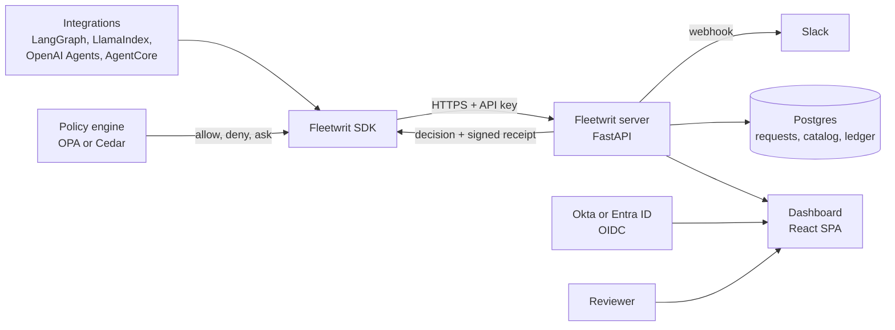
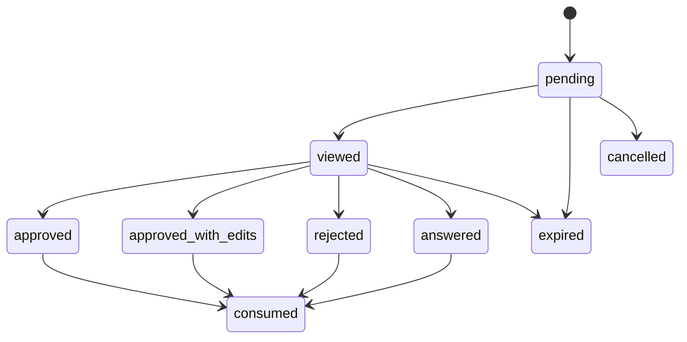
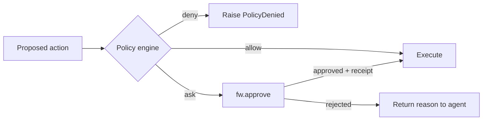
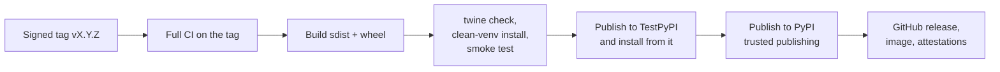

# Fleetwrit — MVP spec

2026-09-18 · @Someone

## Summary

Fleetwrit is the independent authorisation record for consequential AI-agent actions: one control point for who may authorise what an organisation's agents do. An agent stops before a consequential action, a named human decides, the agent resumes on exactly that decision, and the record is tamper-evident and lives outside the system being governed.

It does not compete with the pause-and-resume features agent frameworks now ship. It uses them, and owns what a single runtime cannot: organisation-wide identity, one queue, an action inventory, signed receipts and evidence across stacks.

**This revision changes how the spec is used.** After an external review, the full feature set below is kept as the design, but it is no longer a 17-week build plan. It is split into three evidence gates:

1. **Pilot Core**: the smallest slice that puts one partner's real workflow into production. One vertical (platform/SRE), one partner-chosen runtime, one IdP route, one consequential workflow. About 4 weeks part-time, with partner recruitment starting now.
2. **Partner-blocking next**: built only when a live partner cannot proceed without it.
3. **Post-evidence**: everything else, built after two or three teams say they need the independent layer and at least one pays.

The milestone that matters is not a public 0.1.0. It is a production team saying: "We could use our framework's own approval feature, but we still need this because it tells the organisation who authorised exactly what, across all our agents."

The north-star metric is unchanged: human minutes per 1,000 agent tasks.

## What we need to learn from the first three partners

This page is the pilot contract. Everything after it is the design that serves it.

| Field | Commitment |
| --- | --- |
| Hypothesis | Teams operating consequential AI agents across more than one runtime will pay for an independent human-authorisation system, because framework-native approvals do not give the organisation ownership, identity and audit evidence |
| Initial ICP | Platform and SRE teams running agentic remediation. Finance-ops (AP, refunds, payments) is the second vertical, opened only after the first is proven or disproven |
| Qualifying threshold | About 20 genuine human interrupts a week, or fewer where each one carries financial or operational consequence that makes auditability material |
| Pilot unit | One agent, one runtime, two to five consequential action types, one reviewer group, one production environment |
| Partner commits | A technical owner, a reviewer lead and a commercial sponsor; a 30-minute weekly review; a production rollout; a weekly aggregate usage report; a security review; a pricing conversation |
| We commit | Installation support, pilot-critical fixes, the agreed response window, a weekly metric review, documented handling of security issues |
| Success | Production use for 4 weeks or more; zero lost or duplicated decisions; review latency the partner accepts; a measurable drop in coordination effort against their baseline; the sponsor confirms a budget exists and states a price range |
| Failure | The partner will not put one workflow into production, cannot name a buyer or budget, or concludes after trial that native framework approval is good enough |

**The displacement question**, asked of every partner at qualification and again at commercial review: "Had this product not existed, exactly how would you have solved this?" If the answer stays "the framework's approval feature and a Slack channel", the pilot has to show what the independent record adds, or the thesis is wrong.

## Problem and users

Teams running agents across more than one stack cannot answer who authorised a consequential action, why, and how long it waited. Approvals live in Slack threads and framework-specific interrupts. Nobody owns the queue, abandoned requests freeze agents for hours, and the record sits in the agent team's own database, which fails segregation of duties.

Fleetwrit is "PagerDuty for things AI agents need from humans": the system of record for human authorisation over agents, across stacks. It is not an identity provider for agents and not a policy engine. It signs people in through the IdP the company already has, and it takes verdicts from the policy engine the company already runs.

| User | What they need from the MVP |
| --- | --- |
| Agent developer | One call to pause for a human, durable resume, a native integration for the runtime they already use |
| Reviewer (ops, finance, SRE) | One inbox, the exact action and its context, a decision in under a minute, signed in with their work account |
| Platform or AI governance owner | One view of every agent, every gated action type and every pending decision in the organisation |
| Risk, audit, CISO | A tamper-evident record of which IdP-verified person authorised exactly which action |

First design partners are platform and SRE teams running agentic remediation. Their world already has queues, on-call ownership, change control, fail-closed habits and consequential changes, which is the shape of this product. Finance-ops is the second vertical and waits; running both at once doubles the terminology, compliance questions and workflow variation before the core value is shown.

### Three journeys

These are the product from each person's side. Every feature in Pilot Core exists to make one of them work.

**The developer, Priya, platform engineer.** Her remediation agent can restart services and wants to be allowed to roll back deployments. She runs `pip install fleetwrit`, decorates `rollback_deployment` with `@action`, marks it high risk and irreversible, and wraps her LangGraph tool with the integration. In staging she triggers a rollback, sees the graph pause, approves it in the dashboard and watches the graph resume with the receipt. She kills the agent mid-wait to check the decision still arrives once. It takes an afternoon, and she changes none of her checkpointing.

**The reviewer, Marcus, on-call SRE.** At 02:10 his phone shows an email: a production rollback of `payments-api` awaits approval and expires in 30 minutes. He taps the link, signs in with his work account, and sees the agent's summary, the exact service and target version, the alert that triggered it and the last three decisions on this action type. The target version is one release too far back. He edits the version, the only editable field, gives a one-line reason, types the confirmation and approves. The agent rolls back to his version, not its own. He is back in bed by 02:14.

**The owner, Dana, head of platform, with an auditor beside her.** The post-incident review asks who authorised the 02:12 rollback. Dana searches `payments-api` in the dashboard and opens the decision: Marcus, signed in through Okta at 02:11, approved with an edit from version 41 to version 42, reason recorded, receipt verified, ledger chain intact. The auditor asks what else this agent can do. Dana opens the agent's page: four action types, three gated, one undeclared. That gap becomes this week's ticket.

## Scope by evidence gate

Every capability in this spec sits in one of three gates. The rule for moving something earlier: a live design partner cannot proceed without it. Architectural elegance, completeness and guesses about the market do not qualify.

| Capability | Pilot Core | Partner-blocking next | Post-evidence |
| --- | --- | --- | --- |
| SDK | approve, approve with edits, reject, input, choose, authorize, task; `@action` definitions with registry sync; `fleetwrit.testing`; published to PyPI as a pre-release | Python predicate and OPA policy hook; signed receipts verified in OPA | Cedar; TypeScript SDK |
| Runtimes | One, chosen by the first partner. LangGraph/LangChain is the default assumption | The second runtime a partner actually runs | AgentCore interceptor and every runtime nobody has asked for |
| Identity | One OIDC sign-in route with the first partner's IdP, roles assigned in Settings; Keycloak for tests | Group mapping, fresh sign-in, the second IdP guide | SCIM, further providers |
| Reviewer experience | Inbox and request detail, phone-first, tested as a clickable prototype with 5 to 8 reviewers before it is built | Organisation overview, agents screen, action catalog | Catalog analytics, auto-approve and edit-rate candidates |
| Record | Durable requests, fingerprint, expiry, fail closed, hash-chained ledger with the payload split, searchable decision list, ledger verify and export | Retention settings, subject purge, ledger screen with filters | External anchoring |
| Notifications | Email and one chat webhook, reminder before expiry, `unrouted` queue | Digest mode, generic signed webhook | Teams app, PagerDuty |
| Operations | One production path agreed with the partner: founder-hosted single tenant or the Helm chart with two replicas; `/metrics`; backups; `fleetwrit report` | Alert rules and Grafana dashboard, HA fault suites, opt-in telemetry | Multi-region, hosted multi-tenant cloud |
| Docs and site | Quickstart, defining actions, the one integration guide, install guide, security pack; a one-page site with the design-partner form | Guides for whatever is built in this gate | Full landing page, integrations grid, roadmap, pricing cards, live demo, full docs site |
| Quality | Conformance vectors, SDK and server suites, fault-injection tests for the delivery guarantee, the five acceptance stories, coverage gates, trusted publishing | Suites that ship with each feature | Load, fuzz, mutation and visual regression suites |
| Repositories | Two: the SDK, and the server with dashboard | Unchanged | Split out protocol and site when they have outside consumers |

**Still out of scope in every gate until a paying partner blocks on it:** auth or session takeover, multiplayer handoff, branch and rollback; routing rules, escalation chains, schedules and SLAs; authority limits per person and amount; Fleetwrit's own policy language; interactive approvals inside Slack; a native mobile app.

### Success criteria

| Product measure | Target |
| --- | --- |
| Time from `pip install fleetwrit` to first approved action locally | under 10 minutes |
| Time to add Fleetwrit to an existing agent using the integration | under 30 minutes, following the guide only |
| First partner: signed brief to first real approved action in staging | 10 working days |
| Decisions lost, duplicated, or executed on a different action than approved | 0 |
| Ledger verification failures, including after a payload purge | 0 |
| Server availability in partner production | 99.9% monthly, measured from SDK connection success |
| Test coverage, line and branch | SDK 95%, server 90%; fingerprint, receipt, ledger and decision-delivery modules 100% branch |
| Human minutes per 1,000 agent tasks, and wait time p50 and p95 | reported weekly per partner, against a baseline captured at qualification |

| Commercial funnel stage | Six-week target from the start of outreach |
| --- | --- |
| ICP interviews | 18 to 25 |
| Qualified teams with real interrupt volume | 8 or more |
| Technical evaluations | 4 or more |
| Staging deployments | 3 or more |
| Production pilots | 2 or more |
| Explicit buyer and budget line identified | 2 or more |
| Partner willing to pay | 1 or more |

The funnel is reviewed every Friday. It is the early warning the original plan lacked: three partners by end of Q1 2027 remains the kill criterion, but a funnel that stalls at "qualified" by week 6 says the wedge is weak long before then.

### Acceptance stories

Five guarantees, written so a design partner, a security reviewer and an engineer can all agree on them. Each is an automated test in Pilot Core and a line in the pilot brief.

1. **Exact-action approval.** Given an agent requests approval for an action with fingerprint A, when a reviewer approves it, then a receipt for A is returned, and `authorize()` refuses any action whose fingerprint differs from A.
2. **Approve with edits.** Given a refund of £4,000 where only `amount` is editable, when the reviewer changes it to £500 and approves, then the record holds the original and final fingerprints and the diff, the receipt is signed for the £500 action only, and the client cannot authorise the £4,000 original.
3. **Concurrent reviewers.** Given two authorised reviewers have the same request open, when both submit different decisions at the same moment, then exactly one terminal decision is accepted and the other reviewer is told it was already decided and by whom.
4. **Failure during wait.** Given a request is pending, when the agent process or the server restarts, then the caller re-attaches by idempotency key and consumes no more than one terminal decision.
5. **Expiry.** Given a request reaches its deadline undecided, then the action cannot execute, the expired state is in the ledger, and no later human action can revive that request.

## Architecture

One server sits between every agent stack and every reviewer. Integrations are thin packages over the SDK; the IdP and the policy engine stay the customer's own.



The policy engine says whether to ask. The SDK asks. The reviewer, signed in through the IdP, decides in the dashboard. The server returns the decision once, with a signed receipt the policy engine can verify.

| Component | Choice | Reason |
| --- | --- | --- |
| SDK | Python 3.10+, sync and async | Partner agent stacks are mostly Python |
| Integrations | One extra per runtime: `fleetwrit[langchain]`, `[llamaindex]`, `[openai-agents]`, `[agentcore]` | Core stays dependency-free |
| Server | FastAPI, single container | Same language as the SDK, one thing to deploy |
| Store | Postgres 15+; SQLite in `fleetwrit dev` | State, catalog and ledger in one place |
| Dashboard | React + Vite SPA, served by the server | No separate frontend deploy |
| Sign-in | OIDC authorization code flow with PKCE | Covers Okta and Entra with one code path |
| Receipts | JWS, EdDSA, keys published at `/.well-known/jwks.json` | Verifiable by OPA and by any gateway interceptor |
| Decision delivery | Long-poll by default, signed webhook for checkpointing runtimes | Works without inbound access to the agent |
| Site | Astro with Starlight: landing page and docs in one static build | One repository, one deploy |

**Request lifecycle**



**Delivery guarantee, stated precisely.** "Exactly once" is shorthand, not a distributed-systems absolute. The guarantee is: for one request and one fingerprint, the server accepts at most one terminal decision, and at most one acknowledgement of that decision succeeds. A caller that re-attaches with the same idempotency key receives that same decision and no other. The SDK cannot stop an agent from running its own side effect twice after a crash inside the `authorize()` block; the docs say so and recommend passing the request id as an idempotency key to the downstream system. A reminder goes out when 25% of a request's lifetime remains and it is still undecided.

## SDK: core calls

The SDK has three calls and one guard. Each call creates a request, waits durably, and returns a typed decision.

```python
import fleetwrit

fw = fleetwrit.Client()  # FLEETWRIT_URL, FLEETWRIT_API_KEY from env

decision = fw.approve(
    issue_refund.action(charge="ch_123", amount=400000, currency="gbp"),
    context={"ticket": "ZD-99120", "prior_refunds": 0},
)

if decision.approved:
    with decision.authorize():      # passes only for the action the reviewer approved
        issue_refund(**decision.action.args)
else:
    agent.note(decision.reason)
```

| Call | Returns | Use |
| --- | --- | --- |
| `approve(action, ...)` | `approved`, `modified`, `action`, `reason`, `reviewer`, `receipt` | Yes, yes with edits, or no on one exact action |
| `input(prompt, schema, ...)` | Validated value matching a JSON Schema | Agent is missing a fact only a human has |
| `choose(prompt, options, ...)` | One option id | Agent has 2 to 6 candidate actions |
| `decision.authorize()` | Context manager | Blocks execution if the action no longer matches what was approved |
| `fw.task(name)` | Context manager | Counts agent tasks, the denominator of the north-star metric |
| `fw.guard(policy=...)` | Wrapper | Asks the policy engine first, then a human only if told to |

**Approve with edits.** A reviewer can change args before approving, for example cutting a refund from £4,000 to £500. The server validates the edited args against the action's schema, computes a new fingerprint, and issues the receipt for the edited action. The decision records both fingerprints and the diff. In the SDK, `decision.modified` is true and `decision.action` holds the edited action; `decision.authorize()` only passes for that edited action, so an agent cannot run the original by mistake.

```python
decision = fw.approve(issue_refund.action(charge="ch_123", amount=400000, currency="gbp"))

if decision.approved:
    with decision.authorize():
        issue_refund(**decision.action.args)   # always run decision.action, never the original
```

- An action type opts in with `editable=["amount"]`; fields not listed are read-only on the reviewer's screen. The default is no editable fields.
- `guard.run()` and every integration execute `decision.action` automatically. Where a framework has a native edit outcome, such as LangChain's, the integration maps to it.

**Behaviour**

- **Fingerprint.** SHA-256 over the RFC 8785 canonical JSON of `type`, `version`, `tool`, `args`, `agent_id` and `environment`. Computed in the SDK, recomputed on the server.
- **Idempotency.** Every call takes an `idempotency_key`, defaulting to a hash of run id, step id and fingerprint. A retried call re-attaches to the open request.
- **Durable wait.** Blocking mode long-polls and survives a process restart. Interrupt mode raises the runtime's own interrupt and resumes from a signed webhook.
- **Expiry.** Required; default 1 hour, maximum 7 days. `on_expiry` is `reject` or `raise`. There is no auto-approve on expiry.
- **Failure mode.** If the server is unreachable the SDK raises `FleetwritUnavailable`. It never fails open.
- **Provenance.** Optional `run_id`, `parent_request_id` and W3C `trace_id`, so approvals stay attached across multi-agent chains and link to OTel traces.
- **Configuration.** `FLEETWRIT_URL`, `FLEETWRIT_API_KEY`, `FLEETWRIT_AGENT_ID`, `FLEETWRIT_ENVIRONMENT`. Keys are scoped to one agent and one environment.

## SDK: defining actions

An action is defined once, in code, next to the function that performs it. The definition drives the fingerprint, the reviewer's screen, the default queue and the organisation's catalog.

```python
from fleetwrit import action, Money

@action(
    type="refund.issue",              # domain.verb, stable forever
    title="Issue refund",
    risk="high",                      # low | medium | high | critical
    reversible=False,
    queue="finance-ops",
    expires_in="30m",
    summary="Refund {amount} to customer on charge {charge}",
    display={"amount": Money(currency_field="currency")},
    redact=["card_last4"],
    owner="payments-platform@acme.com",
)
def issue_refund(charge: str, amount: int, currency: str) -> str:
    return stripe.refunds.create(charge=charge, amount=amount, currency=currency).id
```

| Field | Required | Effect |
| --- | --- | --- |
| `type` | Yes | Catalog key. Convention `domain.verb`; renaming creates a new action |
| `title`, `summary` | Yes | What the reviewer reads first; `summary` is a template over the args |
| `risk` | Yes | Sort order in the inbox; `critical` forces typed confirmation and a fresh IdP sign-in |
| `reversible` | Yes | `False` forces typed confirmation |
| args schema | Derived | JSON Schema from type hints or a Pydantic model; args are validated before the request is created |
| `display` | No | Render hints: `Money`, `Diff`, `Code`, `Link`, `Table` |
| `queue`, `expires_in`, `on_expiry` | No | Defaults that a call can override |
| `redact` | No | Fields hashed before they leave the agent process |
| `owner` | No | Shown in the catalog; who to ask about this action |

- **Registry sync.** `fw.register()` runs at agent start and uploads every definition. The dashboard catalog lists each action type, its schema, owner, risk and which agents use it.
- **Versioning.** The version is a hash of the args schema. A schema change creates a new version; old requests keep rendering with the version they were created under.
- **Undeclared actions.** `fw.approve(Action(type=..., args=...))` still works for quick starts. The catalog marks the type as undeclared so a platform owner can see the gap.
- **Review before ship.** `fleetwrit actions lint` fails CI on a missing summary, an unknown display hint or a `type` that breaks the naming convention.

## SDK: policy engines

Fleetwrit does not decide when to ask. A policy engine returns one of three verdicts and the SDK acts on it.



Every verdict is written to the ledger, including allow and deny, so the record shows what was never sent to a human and why.

```python
from fleetwrit.policy import OPA

guard = fw.guard(policy=OPA(url="http://opa:8181", path="agents/actions/verdict"))

result = guard.run(issue_refund, charge="ch_123", amount=400000, currency="gbp")
```

| Option | How it plugs in | In the MVP |
| --- | --- | --- |
| Python predicate | `@action(ask_when=lambda a: a.amount > 50_000)` | Yes |
| Open Policy Agent | `OPA(url, path)`; the rule returns `allow`, `deny` or `ask`, optionally with `queue` and `expires_in` | Yes, with a sample Rego package |
| Cedar | `Cedar(policies, entities)` through `cedarpy`; a `forbid` that names the `fleetwrit_receipt` context key becomes `ask` | Yes, recipe and example |
| AgentCore Policy | Gateway Lambda interceptor, covered under Integrations | Yes |
| Custom | Implement `Policy.evaluate(action, principal, context) -> Verdict` | Yes, 1 method |

**Signed decision receipts.** Every approval carries a compact JWS: request id, fingerprint, outcome, reviewer subject and issuer, authentication time, expiry. A policy engine can then require proof that a human approved this exact call, not merely a flag saying so. OPA verifies it with `io.jwt.decode_verify` against Fleetwrit's JWKS. Cedar cannot verify signatures, so the interceptor verifies the receipt and passes `fleetwrit_receipt_valid` in the Cedar context.

## Integrations

Pilot Core ships one runtime integration, the one the first partner runs, and one OIDC sign-in route. The other integrations specified here are designs held ready, built when a partner's stack calls for them. Each wraps the framework's own pause mechanism, so a team keeps its checkpointing and adds Fleetwrit's queue, identity and record. Native pause-and-resume is improving quickly in every framework, which makes each adapter a permanent maintenance cost; that is the reason not to build four on a guess.

**Agent runtimes**

| Integration | Hooks into | What the developer writes |
| --- | --- | --- |
| LangGraph and LangChain | LangGraph `interrupt()` and `Command(resume=...)`; LangChain's human-in-the-loop middleware | `FleetwritMiddleware(tools={"issue_refund": True})` or `fleetwrit_node()` in a graph |
| LlamaIndex Workflows | `InputRequiredEvent` and `HumanResponseEvent`; context snapshot for resume in a later process | `FleetwritHITL(workflow)` wraps the event stream and answers the pause |
| OpenAI Agents SDK | `needs_approval` on tools; `result.interruptions`, `RunState` approve, reject and resume | `await fleetwrit_run(agent, input)` replaces `Runner.run` and stores `RunState` while waiting |
| Amazon Bedrock AgentCore | Gateway Lambda interceptor in front of MCP tools; works with AgentCore Policy (Cedar) | Deploy the `fleetwrit-agentcore-interceptor` Lambda and list the gated tools |

AgentCore differs from the other three: it gates at the tool gateway, so it covers any framework running on AgentCore Runtime without touching agent code. A tool call without a valid receipt is held, turned into a Fleetwrit request, and retried with the receipt attached.

Each integration ships with a runnable example, a docs guide, and a contract test suite that kills the agent process mid-wait and checks the decision still arrives once.

**Identity providers**

| Provider | MVP scope |
| --- | --- |
| Okta | OIDC sign-in, `groups` claim mapped to Fleetwrit roles and queue membership, tested setup guide. Verified each release against a free Okta developer org |
| Microsoft Entra ID | OIDC sign-in, group object ids or app roles mapped the same way, tested setup guide. Verified each release against a free Entra tenant |
| Google | Development and small-team option through the generic OIDC path: sign-in and reviewer identity only. No group mapping, because Google ID tokens carry no groups claim; roles and queues are assigned by hand in Settings, optionally restricted to one Workspace domain through the `hd` claim. Fresh sign-in for critical actions is not guaranteed; confirm Google's `max_age` and `auth_time` behaviour before relying on it |
| Keycloak or Dex | The mock IdP for local development and CI; also the supported way to federate a provider that is not OIDC |
| Any other OIDC provider | Works through the generic OIDC settings, untested, no guide |
| GitHub | Not supported directly. GitHub user sign-in is OAuth 2.0 without ID tokens, and a second non-OIDC code path in the auth layer is not worth the risk. For a public demo instance, put Dex in front and let it federate GitHub |

- The ledger records the reviewer's issuer, subject, email and authentication time from the ID token, not a Fleetwrit-local username.
- `critical` actions and any action with `reversible=False` can require a fresh sign-in through OIDC `max_age`, so an unattended session cannot approve them.
- Group mapping is evaluated at sign-in. Removing someone from the IdP group removes their queue access at their next session, 8 hours at most.
- Local password accounts remain only for `fleetwrit dev` and for a break-glass admin.

**Notifications.** Three channels, configured per queue, each carrying a deep link to the request and never the args themselves.

| Channel | MVP scope |
| --- | --- |
| Email | SMTP settings in the server config; sent to queue members; plain text plus HTML; the universal fallback for Teams and email-first organisations |
| Slack | Incoming webhook per queue |
| Generic webhook | Signed JSON for anything else, including a Teams workflow or PagerDuty |

- **Events that notify.** New request; reminder when 25% of the lifetime remains; expired without a decision, sent to the queue and to admins.
- **Digest.** Reviewers can switch email to a digest every 15 minutes, so a busy queue does not become noise. `critical` requests always send immediately.
- **Delivery failures** are recorded, shown on the overview's integration health panel, and exposed as a metric.

**Integration status.** One file, `site/data/integrations.json`, lists every integration with a status of `available`, `next` or `planned`. The landing page, the docs index and the dashboard settings page all read it.

| Status at 0.1.0 | Integrations |
| --- | --- |
| Available | LangGraph/LangChain, LlamaIndex, OpenAI Agents SDK, Bedrock AgentCore, Okta, Entra ID, Google sign-in for development, OPA, Cedar, email, Slack, generic webhook, Prometheus metrics, Helm chart |
| Next | TypeScript SDK, CrewAI, Claude Agent SDK, Microsoft Agent Framework, Google ADK, MCP elicitation bridge, Google Workspace groups, Microsoft Teams app |
| Planned | Temporal, Pydantic AI, Auth0, Keycloak guide, PagerDuty, ServiceNow, Slack interactive approvals, SCIM |

The Next list is a guess until partners rank it. Each entry on the landing page links to a GitHub issue where people can vote.

## Data model and protocol

The interrupt request is the protocol. It is published as JSON Schema at a versioned URL, placeholder `fleetwrit.dev/schema/v1` so that another runtime or vendor can emit it without the SDK.

```json
{
  "schema": "fleetwrit/v1",
  "id": "req_01J8ZK3V9Q",
  "kind": "approve",
  "agent": {"id": "support-refunds", "environment": "prod", "version": "2026.09.3"},
  "action": {
    "type": "refund.issue", "version": "a41f09c2",
    "tool": "stripe.refunds.create",
    "args": {"charge": "ch_123", "amount": 400000, "currency": "gbp"},
    "reversible": false
  },
  "fingerprint": "sha256:9f2c...",
  "summary": "Refund £4,000 to customer 8812 for order 5531",
  "context": {"ticket": "ZD-99120", "prior_refunds": 0},
  "queue": "finance-ops",
  "provenance": {"run_id": "run_77", "parent_request_id": null, "trace_id": "4bf92f..."},
  "idempotency_key": "a81c...",
  "created_at": "2026-09-18T10:02:11Z",
  "expires_at": "2026-09-18T10:32:11Z",
  "on_expiry": "reject"
}
```

| Table | Holds | Notes |
| --- | --- | --- |
| `agents` | Agent id, environment, owner, runtime integration, SDK version, last seen, API key hash | One key per agent and environment; feeds the agent registry |
| `action_types` | Type, version, title, risk, reversible, editable fields, args schema, display hints, owner | Written by `fw.register()`; feeds the action catalog |
| `requests` | Request metadata, state, queue, action type and version, fingerprint, payload reference | Unique on `idempotency_key`; holds no args or context |
| `decisions` | Request id, original and final fingerprint, outcome, reviewer reference, receipt, `consumed_at` | One row per request, enforced |
| `payloads` | Args, context, summaries, edit diffs, reasons, reviewer email and name | The only table with personal or customer data; purgeable |
| `policy_verdicts` | Action fingerprint, engine, verdict, policy reference | Allow and deny included |
| `users` | IdP issuer and subject, role, last authentication time | `admin`, `reviewer`, `auditor`, `viewer` |
| `queues`, `group_mappings` | Queue members; IdP group to role and queue | Evaluated at sign-in; one built-in `unrouted` queue |
| `tasks` | Task and run counts per agent per hour | Fed by `fw.task()` and by request provenance |
| `notifications` | Channel, event, delivery status | Feeds integration health |
| `ledger` | Append-only event log of hashes and identifiers | No update or delete, enforced by trigger |

**Ledger.** Events: `agent.registered`, `agent.disabled`, `action_type.registered`, `policy.verdict`, `request.created`, `request.viewed`, `request.reminded`, `decision.made`, `decision.consumed`, `request.expired`, `request.cancelled`, `payload.purged`, `user.login`, `config.changed`. Each row stores `seq`, `ts`, `actor`, `event`, `payload_hash`, `refs`, `prev_hash` and `hash`.

**Payloads are hashed into the chain, not stored in it.** The ledger row carries the SHA-256 of the canonical payload plus opaque identifiers: request id, fingerprint, user id. Names, emails, args and context live only in `payloads`. Deleting a payload leaves its hash in place, so the chain still verifies and still proves that a specific decision on a specific fingerprint happened; it no longer reveals the content.

| Retention setting | Default | Effect |
| --- | --- | --- |
| `FLEETWRIT_PAYLOAD_RETENTION` | 90 days | Payloads older than this are purged nightly; a `payload.purged` event is chained. The default favours privacy; a customer whose audit rules need longer sets it deliberately, and the install guide asks the question |
| Per action type override | None | Shorter or longer retention for one action type, for example 30 days for anything carrying customer contact data, 7 years for financial approvals |
| `fleetwrit payloads purge --subject <ref>` | Manual | Erasure request: deterministically purges every payload tagged with that subject reference, and writes the purge to the ledger |
| Reviewer identity | Kept until the user is erased | Erasing a user replaces name and email with a tombstone; issuer and subject hashes remain for audit continuity |

**Subject references.** Erasure by scanning nested business payloads for a value is fragile, so it is not the mechanism. An action declares which of its args identify a person or resource, `subjects=["customer_id"]` in `@action`, or passes `subjects=[...]` on the call. The SDK sends those references as an indexed field beside the payload. A subject purge is then an index lookup. `fleetwrit payloads scan --value` exists only as a best-effort audit aid for payloads created without references, and its output is labelled as incomplete.

A purged request still appears in search and in the ledger with its metadata, outcome and timing, and is labelled as purged on the detail screen.

```latex
h_n = \mathrm{SHA256}\left(h_{n-1} \,\|\, \mathrm{JCS}(e_n)\right)
```

`fleetwrit ledger verify` walks the chain and reports the first broken sequence number. `fleetwrit ledger export` writes JSONL with the chain head so an auditor can verify it offline.

**North-star metric.** Human minutes are active review time: from first view to decision, capped at 15 minutes per request so an abandoned tab does not distort it.

```latex
\text{human minutes per 1{,}000 tasks} = 1000 \times \frac{\sum_i \min\left(t^{\mathrm{decided}}_i - t^{\mathrm{viewed}}_i,\ 15\right)}{N_{\mathrm{tasks}}}
```

**Denominator fallback.** `fw.task()` is optional, so the metric must not depend on it. When an agent reports no tasks, the server counts distinct `run_id` values from request provenance and from registration heartbeats, and the overview labels the figure "per 1,000 runs". The onboarding checklist asks each partner to add `fw.task()` in week 1.

## Open-source dashboard

The dashboard opens on an organisation-wide overview, not an inbox. Anyone asking "what are our agents waiting on, and who is approving what?" gets the answer on the first screen; reviewers are one click from their queue.

**Build order.** Pilot Core builds two screens, inbox and request detail, plus a plain searchable decision list and the minimum settings. Before either is built, a clickable prototype of inbox, request detail and the overview is tested with 5 to 8 people who review operational changes today, recruited from the ICP interviews. The test tasks are the reviewer journey: find the request, understand the action in 15 seconds, edit one field, approve on a phone. The overview, agents, catalog and full ledger screens below are the design for the next gate, and the prototype sessions are where their content gets challenged first.

| Screen | Audience | Shows | Actions |
| --- | --- | --- | --- |
| Overview | Everyone; home page | Pending now by queue and risk, oldest waiting request, decisions in the last 7 and 30 days, human minutes per 1,000 tasks with trend, approval and expiry rates, fast-approval flags, agents by runtime and environment, newly registered agents and action types, integration health | Drill into any number; filter by environment, team, runtime |
| Inbox | Reviewers | Pending requests for the user's queues, highest risk and soonest expiry first | Filter by queue, agent, kind; open a request |
| Request detail | Reviewers, auditors | Summary, args rendered with the action's display hints, context, provenance, policy verdict that triggered the ask, fingerprint, prior decisions on the same action type | Approve, approve with edits on editable fields, reject with reason, answer, choose; permanent link |
| Agents | Platform owners | Every registered agent: owner, environment, runtime integration, SDK version, last seen, action types used, 30-day volume | Create agent and API key, rotate key, disable agent |
| Action catalog | Platform, risk | Every action type: title, risk, reversible, owner, schema, versions, agents using it, approval rate, undeclared flag | Open history for a type; export catalog as CSV |
| Ledger | Auditors | Every event, newest first, with actor identity and hash; chain status badge | Search by fingerprint, request id, reviewer, agent, resource value; export JSONL; verify chain |
| Settings | Admins | IdP connection and group mappings, queues, Slack webhooks, receipt signing keys, integration status | Test IdP connection; rotate signing key |

**What makes it the organisation's source of truth**

- **Search.** One search box over request ids, fingerprints, agent names, reviewers and arg values such as an order or ticket number. "Who approved the refund on order 5531?" is one query.
- **Permanent links.** Every request and decision has a stable URL that can be pasted into a ticket, an incident review or an audit request.
- **Coverage view.** The overview lists agents seen in the last 30 days with zero gated actions, and action types in use but undeclared. These are the governance gaps.
- **Disable switch.** Disabling an agent on the Agents screen makes every open and future request from it fail closed, and records who did it.
- **Read-only roles.** `auditor` sees everything and decides nothing. `viewer` sees the overview, agents and catalog but not request contents.

**Decision quality rules**

- Reject requires a reason. `reversible=False` requires typed confirmation. `critical` also requires a fresh IdP sign-in.
- The detail screen shows the args exactly as fingerprinted. An agent's changed-args retry appears as a new request, never as an edit.
- Approve with edits shows original and edited values side by side, requires a reason, validates against the schema before submit, and displays the new fingerprint. Only fields the action type marks editable can change.
- Decisions made less than 3 seconds after first view are flagged as fast approvals.
- An action type approved at 99% or more over 100 requests is listed as an auto-approve candidate. An action type edited on more than 20% of approvals is listed as a candidate for a better agent prompt or a policy limit. The MVP only reports both.

**Routing in the open-source edition.** A request names a queue. Queue membership comes from IdP groups. Every member sees the request and the first decision wins. No rules, no escalation, no schedules.

**Unrouted requests.** A request naming a queue that does not exist, or a queue with no members, is never rejected and never lost. It lands in the built-in `unrouted` queue, which every admin belongs to, raises a warning on the overview, and notifies admins. The SDK logs a warning with the queue name so the developer sees the typo.

**Mobile.** Inbox and request detail are designed phone-first: a single column, the summary and risk above the fold, args collapsed by default, approve and reject as full-width buttons, and typed confirmation that works with a phone keyboard. IdP sign-in, including fresh sign-in, must complete in a mobile browser. Overview, agents, catalog and ledger are responsive but designed for desktop. There is no native app.

**Live updates.** Server-sent events for the overview counters and the inbox.

**Local mode.** `fleetwrit dev` starts the server, SQLite and the dashboard on `localhost:4100` with auth off, a seeded demo agent and 30 days of synthetic history so the overview is not empty in a demo.

## Server API, deployment and security

The server exposes an agent-facing API authenticated by API key and a dashboard-facing API authenticated by an IdP session, both under `/v1` and documented with OpenAPI.

| Endpoint | Caller | Purpose |
| --- | --- | --- |
| `POST /v1/agents/register` | SDK | Upsert agent metadata and action type definitions |
| `POST /v1/requests` | SDK | Create or re-attach by idempotency key |
| `GET /v1/requests/{id}/decision?wait=30` | SDK | Long-poll for the decision and receipt |
| `POST /v1/requests/{id}/ack` | SDK | Mark the decision consumed; succeeds once |
| `POST /v1/requests/{id}/cancel` | SDK | Agent no longer needs the answer |
| `POST /v1/verdicts`, `POST /v1/tasks` | SDK | Batched policy verdicts and task counts |
| `GET /v1/overview` | Dashboard | Organisation aggregates |
| `GET /v1/inbox`, `GET /v1/requests/{id}` | Dashboard | List and detail |
| `POST /v1/requests/{id}/decide` | Dashboard | Approve, reject, answer or choose |
| `GET /v1/agents`, `GET /v1/action-types` | Dashboard | Registries |
| `GET /v1/search?q=` | Dashboard | Requests by id, fingerprint, reviewer, arg value |
| `GET /v1/ledger`, `GET /v1/ledger/verify` | Dashboard, CLI | Read and verify the chain |
| `GET /v1/events` | Dashboard | Server-sent events |
| `GET /auth/login`, `/auth/callback`, `/auth/logout` | Browser | OIDC code flow with PKCE |
| `GET /.well-known/jwks.json` | Policy engines, interceptors | Receipt verification keys |

**Outbound webhooks.** `request.created` goes to the queue's Slack webhook. `decision.made` goes to the agent's resume URL in interrupt mode. Both are signed with HMAC-SHA256 over timestamp and body and retried with backoff for 24 hours.

**Operational endpoints.** `GET /metrics` in Prometheus format, `GET /healthz`, `GET /readyz` (checks Postgres and migrations), and `GET /v1/report` for the usage report described under Design partner readiness.

**Deployment.** Three supported paths, all from the same image.

| Path | For | Contents |
| --- | --- | --- |
| `fleetwrit dev` | A developer's laptop | pip only, SQLite, auth off |
| `docker compose up` | Evaluation and small teams | Server, Postgres, Keycloak profile for trying sign-in |
| Helm chart | Partner production | 2 or more server replicas, external Postgres by connection secret, ingress with TLS, existing-secret references for API signing keys, OIDC client secret and SMTP, PodDisruptionBudget, anti-affinity, resource requests, NetworkPolicy, ServiceMonitor, migration Job as a pre-upgrade hook |

The chart is published as an OCI artifact on GHCR, and is tested on EKS and on kind in CI. The docs name managed Postgres with point-in-time recovery as the supported production database (RDS, Cloud SQL, Azure Database); running Postgres inside the cluster is documented as evaluation-only. The AgentCore interceptor ships as a separate Lambda zip with a SAM template.

**Availability.** The SDK fails closed, so Fleetwrit is a production dependency of every gated agent. The design target is 99.9% monthly.

- **Stateless server.** All state is in Postgres. Replicas share nothing; long-polls and server-sent events reconnect to any replica. Decision writes and acknowledgements use row locks, so two replicas cannot both win.
- **Background work** (expiry sweeper, reminders, purge, webhook retries) runs on every replica behind a Postgres advisory lock, so exactly one does the work and another takes over within 30 seconds.
- **Zero-downtime upgrades.** Migrations are backward compatible for one minor version: add first, remove in the next release. Rolling update with `maxUnavailable: 0`.
- **SDK resilience.** Retries with jittered backoff for 60 seconds before raising `FleetwritUnavailable`; an open request survives a server restart because the SDK re-attaches by idempotency key.
- **Degraded mode.** If Postgres is read-only during a failover, the server keeps serving the dashboard read-only and returns a retryable error to the SDK instead of failing requests.
- **Break-glass, for an IdP outage only.** A designed interface, never database access. The server exposes a separate break-glass sign-in that does not depend on the IdP: at most two named local accounts, each bound to a hardware security key (WebAuthn), disabled by default and enabled per incident by config change. A break-glass session lasts 60 minutes, can only decide requests, requires a reason on every decision, notifies every admin immediately, chains each decision with `actor=break_glass`, and shows in red on the overview until an admin reviews it. If the server itself is down nobody can decide and agents stay held; that is the fail-closed design, and there is deliberately no fail-open switch. Break-glass has its own section in the threat model.

| Metric | Alert shipped in the chart |
| --- | --- |
| `fleetwrit_requests_pending` by queue, and age of the oldest | Oldest pending request older than 50% of its lifetime |
| `fleetwrit_requests_expired_total` | Any expiry of a `high` or `critical` request |
| `fleetwrit_unrouted_requests` | Above 0 for 5 minutes |
| `fleetwrit_sdk_errors_total`, `fleetwrit_http_request_duration_seconds` | 5xx rate above 1% or p95 above 500 ms for 5 minutes |
| `fleetwrit_notification_failures_total` | Any channel failing for 10 minutes |
| `fleetwrit_ledger_verify_ok` | Nightly verification failed |
| `fleetwrit_agent_last_seen_seconds` | A production agent silent for longer than its usual interval |

A Grafana dashboard JSON ships beside the alert rules. Structured JSON logs carry request id and trace id; OTel export is optional.

**Security baseline**

- API keys are shown once and stored as Argon2 hashes, scoped to one agent and one environment.
- ID tokens are validated for issuer, audience, nonce, signature and expiry. Sessions are server-side, 8 hours, in an HttpOnly SameSite cookie.
- The decide endpoint requires a session whose user belongs to the request's queue. Fingerprint, expiry and, where required, `auth_time` freshness are re-checked inside the transaction that writes the decision.
- An agent API key can never call a dashboard endpoint. An agent cannot approve its own request.
- Receipts are signed with an Ed25519 key held by the server. Receipts are audit artefacts expected to outlive keys, so verification must survive rotation: every signing key has an id carried in the receipt header, a rotation chains a key-rotated event containing the new public key into the ledger, retired public keys are never deleted and stay available from a key-history endpoint and in every ledger export, and the CLI can verify any receipt offline from an exported key history. Private keys are destroyed on rotation.
- The ledger table rejects update and delete through a database trigger, and the app's database role cannot drop it.
- `redact` fields are hashed in the SDK before they leave the agent process.
- TLS is terminated by the deployer's proxy. The server refuses non-local plain HTTP unless `FLEETWRIT_INSECURE=1`.

**Capacity target.** 50 requests per second created and 10,000 open requests on a 2 vCPU container, with the overview query under 300 ms at 1 million ledger rows.

## Landing page

One page with one job: a platform lead understands in 30 seconds that Fleetwrit is where their organisation approves agent actions, sees that their stack is supported or coming, and either runs the quickstart or books a call.

**Gate.** Pilot Core ships only a one-page site: the positioning line, the problem in three lines, how it works with the code sample, and the design-partner form. It exists so an outreach email has somewhere credible to point. The full page specified below, with the integrations grid, roadmap, pricing cards and live demo, is Post-evidence: it is public-launch machinery, and its integration list should be written by partners, not guessed. The hero line for both versions: "The independent authorisation record for consequential AI-agent actions."

**Build instruction.** Build it with the `frontend-design` Claude plugin, and commit to a distinct visual direction before writing markup. It must not read as a templated developer-tool page. The concept to explore is the writ: a fleet of agent trajectories, each stopping at a marked point until a signed order releases it. Seals, signatures and ledger lines are the visual vocabulary; avoid generic shield and robot imagery. Dashboard screenshots are real, taken from `fleetwrit dev` seeded data.

| # | Section | Content |
| --- | --- | --- |
| 1 | Hero | Headline on the organisation-wide promise, one sentence of support, two buttons: "Run the quickstart" and "Become a design partner". A third, quieter link: "Open the live demo". A short looping capture: agent pauses, reviewer approves, agent resumes |
| 2 | The problem | Three lines: approvals scattered across Slack and frameworks; no owner for the queue; no record an auditor accepts |
| 3 | How it works | Four steps with the 12-line code sample: define the action, ask, decide, resume with a receipt |
| 4 | One place for the organisation | Overview screenshot, then agents, action catalog and ledger as three smaller captures |
| 5 | Integrations | Grid grouped by Agent runtimes, Identity, Policy engines, Notifications. Every tile carries a status badge: Available, Next or Planned. Next and Planned tiles link to the GitHub issue for votes. A "Request an integration" tile ends the grid |
| 6 | Roadmap | Three columns, Now, Next, Later, generated from the same data file plus product items such as routing and escalation |
| 7 | Open source and paid | The boundary table from this spec in plain language; Apache-2.0; self-hosted |
| 8 | Pricing | Three cards, no feature grid. **Community:** free forever, self-hosted, everything in the MVP. **Design partner programme:** the monthly fee shown on the page, six months, direct line to the founder, roadmap influence, locked discount on the paid product. **Enterprise:** "Talk to us", listing what is coming: routing and escalation, authority limits, maker-checker, SCIM, evidence packs, multi-workspace, support SLA. One line under the cards: unlimited reviewers on every plan; paid plans are priced by active agents, never by approvals |
| 9 | Trust | How fingerprinting, receipts and the hash-chained ledger work, with a link to the security model doc |
| 10 | Footer call to action | Quickstart command in a copy box, GitHub, docs, design-partner contact |

- **Data-driven.** The integrations grid and roadmap render from `site/data/integrations.json`. Shipping an integration means changing one status field.
- **Stack.** Astro static build in `site/`, shared with the docs. No client framework on the landing page; the hero capture is a video with a poster image.
- **Performance and access.** Lighthouse performance and accessibility at 95 or above on mobile, works without JavaScript, respects `prefers-reduced-motion` and `prefers-color-scheme`.
- **Measurement.** Privacy-friendly page analytics and two tracked events: quickstart command copied, design-partner link clicked.
- **Not on the page.** A Team or Enterprise price before a partner has validated it, a feature-tick comparison grid for plans that do not exist yet, customer logos that do not exist, and any claim of compliance certification.

## Documentation

The docs are a release blocker, written alongside each feature and tested in CI. Every code sample is extracted and run against `fleetwrit dev`.

**Gate.** Pilot Core writes five things: the quickstart, defining actions, the one integration guide, the install guide for the agreed production path, and the security pack. They can live as Markdown in the repositories. The full site and the remaining areas below follow the features they document.

| Area | Pages |
| --- | --- |
| Get started | Quickstart in 10 minutes; core concepts: action, request, decision, receipt, queue, ledger |
| Defining actions | Anatomy of an action; naming and risk levels; summaries and display hints; args schemas with Pydantic; redaction; versioning; undeclared actions; linting in CI; a worked catalog for a support agent and an SRE agent |
| Asking a human | approve, input and choose; expiry and `on_expiry`; idempotency and retries; blocking versus interrupt mode; multi-agent provenance |
| Policy engines | The allow, deny, ask contract; OPA guide with a sample Rego package; Cedar guide; verifying decision receipts in OPA and in a gateway; writing a custom `Policy` |
| Integrations | One guide each: LangGraph/LangChain, LlamaIndex Workflows, OpenAI Agents SDK, Bedrock AgentCore. Each has prerequisites, a 5-minute path, how resume works in that runtime, and known limits |
| Identity | Okta setup; Entra ID setup; group mapping; fresh sign-in for critical actions; Google sign-in for development, with its limits; Keycloak for local testing; federating GitHub through Dex; generic OIDC |
| Operate | Self-hosting with docker compose; upgrades and migrations; backup; key rotation; verifying and exporting the ledger; metrics definitions |
| Reference | Python API, generated; REST API from OpenAPI; protocol schemas; webhook contract; CLI |
| Security model | Threat model, what Fleetwrit does and does not protect against, fail-closed behaviour |

Docs use Astro Starlight inside `site/`. The Integrations index reads the same `integrations.json`, so the landing page and the docs never disagree about what is available.

## Packaging and release

`pip install fleetwrit` is the front door. The SDK goes to PyPI from the first alpha, and so does the server, because `fleetwrit dev` has to work from pip alone with no Docker and no Node.

| Artifact | Where | Contents |
| --- | --- | --- |
| `fleetwrit` | PyPI | SDK core, action catalog, policy hook, CLI, `fleetwrit.testing`. Pure Python, no framework dependencies |
| `fleetwrit[langchain]`, `[llamaindex]`, `[openai-agents]`, `[agentcore]` | PyPI extras | Integration code ships inside `fleetwrit.integrations.*` with lazy imports; the extra only pins the framework's supported version range |
| `fleetwrit[opa]`, `[cedar]` | PyPI extras | Policy adapters and their client libraries |
| `fleetwrit-server` | PyPI | FastAPI server with the built dashboard bundled as static files in the wheel. Pulled in by `pip install "fleetwrit[dev]"` so `fleetwrit dev` runs locally |
| `ghcr.io/fleetwrit/server` | GitHub Container Registry | Production image, multi-arch, same version as `fleetwrit-server` |
| `oci://ghcr.io/fleetwrit/charts/fleetwrit` | GitHub Container Registry | Helm chart, alert rules, Grafana dashboard; chart version tracks the server version |
| `fleetwrit-agentcore-interceptor.zip` | GitHub release asset | Lambda package and SAM template |
| Protocol schemas | Versioned URL and GitHub release | JSON Schemas and conformance test vectors |

**Packaging standards**

- `pyproject.toml` with the Hatchling backend, `src/` layout, `py.typed` marker, full type hints, Python 3.10 to 3.13.
- Core runtime dependencies limited to `httpx`, `pydantic` and `cryptography`. Anything else needs a written reason.
- Semantic versioning. Until 1.0 a minor version may break the API; the protocol has its own version and never breaks inside `v1`.
- The SDK and server negotiate protocol version at connect time. A server accepts SDKs one minor version older and newer, and the SDK raises a clear error outside that range.
- A changelog in Keep a Changelog format, generated from conventional commits and edited by hand before release.

**Release pipeline**



A release is a signed git tag; everything after it is automated and stops at the first failure.

- **No API tokens.** PyPI trusted publishing through GitHub Actions OIDC, from a protected `release` environment that requires manual approval.
- **Provenance.** Build attestations for the wheels and the container image; an SBOM attached to each GitHub release.
- **Yank policy.** A release with a correctness bug in fingerprinting, receipts or decision delivery is yanked within 24 hours and a fixed patch published.
- **Names.** Register the PyPI project and the GitHub organisation in week 1 by publishing a real `0.1.0a1` pre-release, not an empty placeholder.

| Version | When | Audience |
| --- | --- | --- |
| `0.1.0a1` onward | End of Pilot Core, about week 4 | First design partner; installable with `pip install --pre` |
| Further alphas | Through the partner-blocking gate | One release per partner-blocking item, so every partner runs a tagged version |
| `0.1.0b1` | When the third partner is in production | API frozen except for bug fixes |
| `0.1.0` | Post-evidence gate | Public launch |

## Testing and quality

Every component has its own suite, and no component releases without it passing. Tests are written with the feature, in the same pull request; a feature without tests is not done.

**Gate.** The standard does not relax for Pilot Core; the surface is just smaller. Pilot Core carries the protocol vectors, the SDK and server suites, the fault-injection harness and the five acceptance stories, because those protect the guarantee a partner is trusting. Each later suite in the tables below ships in the same gate as the feature it tests. Load, fuzz, mutation and visual-regression suites are Post-evidence.

| Component | Suites | Tools |
| --- | --- | --- |
| Protocol | Schema validation of every example; conformance vectors for fingerprints, receipts and ledger hashes that the SDK and server must both reproduce byte for byte | `jsonschema`, shared vector files |
| SDK core | Unit tests for every public call; property-based tests for canonicalisation and idempotency keys; sync and async parity; retry, timeout and fail-closed behaviour against a fake server; type-check of the public API | `pytest`, `hypothesis`, `respx`, `mypy --strict`, `pyright` |
| Action catalog | Schema derivation from type hints and Pydantic; summary templates; display hints; redaction; versioning; lint command | `pytest`, snapshot tests |
| Policy hook | Verdict mapping for OPA and Cedar against real engines; receipt verification inside Rego | OPA container, `cedarpy` |
| Integrations | One contract suite run per framework: pause, decide, resume once; process killed mid-wait; rejection path; expiry path. Matrix of oldest supported and latest framework version, plus a nightly run against pre-releases | `pytest`, `nox`, recorded model responses so no LLM key is needed |
| Server | API tests generated from the OpenAPI document; state machine tests for every transition and every illegal transition; database tests on real Postgres; migration up and down; OIDC flows against a mock IdP; authorisation matrix of every role against every endpoint | `pytest`, `schemathesis`, `testcontainers`, mock OIDC server |
| Exactly-once and durability | Fault injection: kill the SDK, kill the server, drop the network, race two acknowledgements, race two reviewers. Assert one decision, one consumption, intact chain | Custom harness, `toxiproxy` |
| Ledger | Tamper tests: edit, delete and reorder rows, then assert `verify` names the first broken sequence; trigger and permission tests | `pytest`, Postgres |
| Dashboard | Component tests; end-to-end flows for sign-in, approve, reject, fresh sign-in, search and agent disable; accessibility checks on every screen; visual regression on the overview and request detail | Vitest, Testing Library, Playwright, axe |
| AgentCore interceptor | Unit tests with mocked AWS; local invoke of held, approved and rejected tool calls; one gated deploy test in a sandbox account per release | `moto`, SAM local |
| Site and docs | Every code sample extracted and executed; link check; landing page Lighthouse budget; `integrations.json` schema | `pytest` doc runner, Lighthouse CI |
| Packaging | Build, `twine check`, install the wheel into a clean environment on each OS and Python version, run the quickstart | `nox`, GitHub Actions matrix |
| System | Full stack from `docker compose`: SDK from the built wheel, server image, Postgres, mock IdP, OPA; the refund and SRE examples run to completion | Playwright plus `pytest` |
| Load | The capacity target, run weekly and before each release | Locust |
| Security | Dependency audit, static analysis, secret scanning, container scan; fuzzing of the request parser and receipt verifier | `pip-audit`, `bandit`, CodeQL, Trivy, `atheris` |

**Identity testing.** Three layers, because no single provider exercises everything. A Keycloak container in CI covers groups claims, `max_age` and `auth_time`, token expiry, signing-key rotation and malformed tokens, offline and on every pull request. The Okta developer org and the Entra tenant are checked by a scripted sign-in before each release, which is what keeps the two setup guides honest. Google is a convenience login for development instances and gets a sign-in smoke test only.

**Partner-readiness suites.** These cover the features a partner depends on in production.

| Area | What is tested |
| --- | --- |
| Approve with edits | Schema validation of edits, non-editable fields rejected server-side, receipt bound to the edited fingerprint, `authorize()` refuses the original action, every integration executes the edited action |
| Payload retention | Purge by age, by action type and by subject; `verify` passes after each; purged requests render; no personal data remains in the ledger table, checked by scanning it for seeded values |
| Notifications | Email through a local SMTP sink, Slack and webhook through a recorder; reminder timing; digest batching; failure recording; no args in any message body |
| High availability | Two replicas on kind: kill one mid-long-poll, kill the advisory-lock holder, fail over Postgres, rolling upgrade across a migration; assert no lost or duplicated decision and no missed expiry |
| Helm chart | `helm lint`, schema-validated values, template snapshot tests, install and upgrade on kind, install on EKS before each release |
| Unrouted and mobile | Unknown and empty queues land in `unrouted`; Playwright runs the reviewer flows at a 390 px viewport including fresh sign-in |
| Usage report and telemetry | Report contents match the database; telemetry is off by default; an allow-list test fails if any field outside the documented schema is sent |
| Demo instance | Nightly reset job, read-only enforcement, seeded data has no real names or domains |

**`fleetwrit.testing`.** The SDK ships test helpers for its users: `auto_approve()`, `auto_reject(reason)`, `scripted([...])` and a `pytest` fixture that runs an in-memory server. Teams can test their own agents' approval paths without a network or a reviewer. It is part of the public API and tested as such.

**Gates**

- Pull requests need lint (`ruff`), types, unit and integration suites green, and coverage at or above the targets in Success criteria. Coverage may not drop by more than 0.5 points in one pull request.
- Mutation testing runs weekly on the fingerprint, receipt, ledger and decision-delivery modules, with a surviving-mutant budget of 0 for those four.
- The main branch runs the system, fault-injection and cross-repository suites on every merge. A red main blocks all releases.
- Flaky tests are quarantined within one day and fixed or deleted within one week. Retrying a test until it passes is not allowed in CI.
- Tests never call a live LLM, a live IdP or a live Slack. Everything external is recorded, mocked or containerised, so the full suite runs on a laptop with `nox`.

## Open-source boundary and repo layout

Everything in this spec is Apache-2.0. The line is no longer drawn by team count, because the open edition now covers the whole organisation. It is drawn by operations: the open edition records and displays, the paid control plane routes, enforces and proves.

| Capability | Open source (this MVP) | Paid control plane (later) |
| --- | --- | --- |
| SDK, protocol, integrations, policy hook | Yes | Same |
| Requests, fingerprint, expiry, receipts | Yes | Same |
| Dashboard | Overview, inbox, agents, catalog, ledger, one workspace | Multiple workspaces and business units, delegated administration |
| Routing | Named queue, members from IdP groups, first decision wins | Rules, escalation chains, schedules, SLAs, out-of-office delegation |
| Identity | Okta and Entra sign-in, group mapping, fresh sign-in | SCIM, authority limits per person and amount, maker-checker across two approvers |
| Ledger | Hash chain, verify, JSONL export | External anchoring, retention policy, Article 14 and SOX evidence packs |
| Analytics | Overview metrics, 30 days | Analytics-to-policy recommendations, long retention, cross-team benchmarks |
| Hosting and support | Self-hosted, community | Hosted, self-hosted enterprise, support SLA |

**This boundary is a business-model experiment, not an architectural decision.** Giving away the organisation view, IdP sign-in, catalog and ledger may be right for adoption, but nobody has yet shown that routing, escalation, authority limits, maker-checker and evidence packs carry enough budget to be a business. Three consequences follow. Nothing public commits to the boundary before the commercial reviews. Every partner's commercial review asks which paid-column items they would pay for and which open-column items they would have paid for. And the code keeps the organisation-level features in separable modules, so the line can move either way without a rewrite. The one fixed rule stays: no routing rules, escalation, authority limits or evidence packs in the open repository.

**Repositories**

Start with two repositories: `fleetwrit-python` for the SDK, with the protocol schemas and conformance vectors in a `protocol/` folder, and `fleetwrit` for the server, dashboard and deployment. The one-page site lives in the server repository until the full site is built. The four-repository layout below is the target once the protocol has outside consumers and the site has its own release rhythm; splitting earlier costs a solo maintainer CI and version-pinning time for no partner benefit.

| Repository | Contents | Releases |
| --- | --- | --- |
| `fleetwrit-protocol` | JSON Schemas, receipt format, webhook contract, conformance vectors | Tagged schema versions |
| `fleetwrit-python` | SDK core, action catalog, policy hook, integrations, CLI, `fleetwrit.testing`, examples | `fleetwrit` on PyPI |
| `fleetwrit` | Server, dashboard, migrations, docker-compose, AgentCore interceptor, system and fault-injection tests | `fleetwrit-server` on PyPI, image on GHCR, Lambda zip |
| `fleetwrit-site` | Under site/: landing page, docs, `data/integrations.json` | Static deploy on merge |

```text
fleetwrit-python/
  src/fleetwrit/            client, actions, policy, testing, cli
  src/fleetwrit/integrations/   langchain, llamaindex, openai_agents, agentcore
  tests/                   unit, property, contract/<framework>, packaging
  examples/                refund agent, SRE agent, one per integration
  noxfile.py  pyproject.toml

fleetwrit/
  server/                  FastAPI app, OIDC, ledger, migrations, tests
  dashboard/               React SPA, component and Playwright tests
  interceptor/             AgentCore Lambda, SAM template, tests
  system-tests/            full stack, fault injection, load
  deploy/                  Dockerfile, docker-compose.yml
```

- **Shared contract.** Both code repositories pin a `fleetwrit-protocol` tag and run its conformance vectors. A protocol change lands there first.
- **Cross-repository CI.** Every merge to `fleetwrit-python` main triggers the system suite in `fleetwrit` against the new SDK build, and the reverse. Docs samples run against the latest pre-release of both.
- **Integrations stay in the SDK repository** for the MVP. Split one out only when its release cadence or maintainer differs.
- **Cost.** Four repositories mean four CI configurations and cross-repository version pinning for a solo maintainer. If that drags, merging `fleetwrit-protocol` into `fleetwrit-python` is the first simplification.

Contributions need a DCO sign-off, not a CLA, to keep the integration ecosystem easy to join.

## Pricing hypothesis

Paid plans charge a platform fee plus bands of active agents, with unlimited humans. Every number here is a starting point to test in partner conversations, not a decision; competitor pricing has not been checked.

| Unit considered | Verdict | Reason |
| --- | --- | --- |
| Per approval or per action | Rejected | The north-star metric is fewer human minutes per 1,000 tasks; revenue would fall as the product works, and customers would be penalised for growing autonomy |
| Per reviewer seat | Rejected | The product is meant to be the whole organisation's source of truth; seat pricing makes the buyer ration access for reviewers, auditors and risk staff |
| Per active agent, plus platform fee | Chosen | Grows with the customer's agent adoption, is easy to forecast, and the agent registry already measures it |

An agent is active if it registered or created a request in the last 30 days, counted per environment.

| Plan | Price to test | Includes |
| --- | --- | --- |
| Community | Free | Everything in this MVP, self-hosted, Apache-2.0 |
| Design partner | £1,000 to £2,000 a month for 6 months | Community plus direct support, roadmap influence, locked discount later |
| Team | £1,500 to £2,500 a month, about 25 active agents included | Routing rules, escalation, schedules, SLAs; hosted or licensed |
| Enterprise | £50,000 to £120,000 a year | Authority limits, maker-checker, SCIM, evidence packs, multi-workspace, self-hosted enterprise, support SLA |

The comparison set for buyers is compliance and incident tooling, not developer tools. Two questions to ask every partner: what would you pay for this, and which budget line would it come from?

## Design partner readiness

A partner is ready to go live when they can deploy it their way, we can see how it is used, a buyer can see it without installing anything, and both sides know what support looks like. This section specifies those four things.

### Two ways to run a pilot

| Option | What it is | When to use |
| --- | --- | --- |
| Partner-hosted | The Helm chart in the partner's own cluster, their Postgres, their IdP | Regulated partners; anything with customer data in args or context |
| Founder-hosted, single tenant | One isolated instance per partner, run by us: separate namespace, separate database, separate signing keys, partner's IdP, EU or UK region, nightly backups | Partners who want to start in days rather than wait for their platform team |

Founder-hosted instances are deployed from the same chart through a small Terraform module in a private `fleetwrit-ops` repository. This is not the multi-tenant cloud, which stays out of scope. Founder-hosting makes us a data processor for the partner, so three things must be true before any production workflow carrying meaningful customer data runs on it: a signed DPA naming sub-processors and region, the security pack delivered, and the external review of authentication and receipt signing completed. That review was previously scheduled for the public release; it moves here because the product's promise rests on exactly those two mechanisms.

### Usage visibility

Self-hosted open source tells us nothing by default, so the MVP ships two explicit mechanisms and no hidden one.

| Mechanism | Default | Contents |
| --- | --- | --- |
| `fleetwrit report` and `GET /v1/report` | Available to every install | A JSON and PDF summary for a date range: requests by action type and outcome, edit rate, expiry rate, wait time p50 and p95, human minutes per 1,000 tasks, fast-approval rate, agents and integrations in use, versions. Counts and durations only; no args, context, names or emails. The partner reads it before sending it |
| Opt-in telemetry | Off | The same aggregates, sent weekly to a Fleetwrit endpoint when `FLEETWRIT_TELEMETRY=on`. The schema is documented, the payload is viewable in Settings before it is enabled, and a test fails the build if an undocumented field is added |

The design-partner agreement asks for one of the two. The weekly report is also the agenda for the weekly call.

### Live demo

**Gate: Post-evidence.** Until then, the recorded two-minute demo and a screen-share of the local seeded instance do this job in partner calls.

A public, read-only instance at a `demo.` subdomain, linked from the landing page hero and the pricing section, for the platform lead or risk owner who will never run `pip install`.

- Seeded with three fictional agents (support refunds, SRE remediation, AP invoices), 30 days of synthetic history, and a small trickle of new synthetic requests so the overview moves.
- Visitors enter as a `viewer`-plus role that can open every screen and press approve, reject and edit; decisions are accepted in the interface and discarded by a nightly reset.
- No sign-up. A banner explains it is synthetic and links to the quickstart and the design-partner form.
- Runs from the same image with `FLEETWRIT_DEMO=1`, which disables settings, keys, outbound notifications and telemetry.

### Seven-week partner engagement

The objective is not to install software. It is to find out whether the independent authorisation layer creates enough operational and audit value to be paid for. Each partner runs this sequence from their own start date; learning and conversion control the timeline, not the feature inventory.

| Week | Main question | Partner does | Required output |
| --- | --- | --- | --- |
| 1 Qualification | Is this a painful workflow or an interesting demo? | Shows the real interrupt workflow, weekly volumes, current approval mechanism and the buyer; answers the displacement question | One-page pilot brief: 1 agent, 2 to 5 action types, named technical owner, reviewer lead and economic sponsor, quantified baseline |
| 2 Architecture | Does it fit their environment without unacceptable security or data risk? | Chooses runtime, IdP and hosting option; reviews the data map and security pack | Agreed data flow, success criteria with numbers, retention setting, signed agreement and DPA where needed, production date |
| 3 Staging | Does the integration preserve their runtime's semantics? | Integrates the one runtime; runs the five acceptance stories themselves | Staging sign-off and the first genuine human-reviewed action |
| 4 Controlled production | Will they trust it in the execution path? | Gates one real consequential action type; runs the normal review rota | A week of production decisions, zero lost or duplicated, baseline wait and review metrics |
| 5 Expansion and hardening | Which missing feature truly blocks adoption? | Names blockers; tests outage, recovery and notification behaviour | Ranked, evidence-backed backlog; a second action type if justified |
| 6 Commercial review | Is the value material enough to pay for? | Compares against the old workflow and the native-runtime alternative; the buyer reacts to a real price | Written go, extend or stop decision and an explicit pricing signal |
| 7 Optional expansion | Does the value repeat beyond the first workflow? | Adds a second agent, team or action family | Expansion proof, case-study material, paid-term proposal |

**What the partner signs up to, on one page in the brief:** three named people (technical owner, reviewer lead, commercial sponsor); 30 minutes a week; one production workflow; the weekly usage report; a security contact; and an honest willingness-to-pay conversation in week 6. A team that will not commit to these is a friendly user, not a design partner.

**Install checklist.** Sign-in works for a reviewer and an auditor; a test request reaches email and Slack; a reminder fires; an unknown queue lands in `unrouted`; `fleetwrit ledger verify` passes; alerts reach their on-call tool; backup restore tested once; break-glass account sealed and its procedure read.

**Support commitments during a pilot**

| Severity | Definition | First response | Channel |
| --- | --- | --- | --- |
| 1 | Production agents blocked, or a lost or duplicated decision | 1 hour, 08:00 to 20:00 UK time, 7 days | Phone number plus shared channel |
| 2 | A feature is broken with a workaround | Next working day | Shared channel |
| 3 | Question or request | 3 working days | Shared channel or GitHub issue |

One person cannot offer 24-hour cover, and the agreement says so. The mitigation is the design: partners run two replicas, the SDK retries, open requests survive restarts, and the break-glass procedure does not depend on us.

**Security pack**, kept in `fleetwrit-site` and sent before kickoff: architecture and data-flow diagram, what data Fleetwrit stores and where, the retention and purge model, the threat model, `SECURITY.md` with a disclosure address, the SBOM, the external review summary once done, and answers to a standard vendor security questionnaire.

**Feedback log.** One table per partner in a private repository: date, request, severity to them, whether it blocks expansion, decision. Anything asked for by two of three partners moves into the next milestone; anything asked for by one waits.

## Plan

Recruitment starts now and does not wait for code. Pilot Core takes about 4 weeks part-time; the external review suggested 3, which is realistic only full-time. The first partner's staging week should land as Pilot Core completes.

| When | Build | Partner track |
| --- | --- | --- |
| Week 0, now | Name cleared and registered; one-page site; design-partner agreement and DPA drafted; IP and conflict check on current contracts | Outreach begins: 4 to 5 ICP conversations a week; funnel reviewed every Friday |
| Weeks 1 to 2 | Two repositories, CI, coverage gates, trusted publishing; protocol v1 and conformance vectors; server core with the ledger payload split; SDK core calls including approve with edits; clickable reviewer prototype tested with 5 to 8 reviewers | Qualification calls; first pilot brief signed; runtime and IdP for Pilot Core confirmed by the partner, not assumed |
| Weeks 3 to 4 | The one runtime integration; inbox and request detail; OIDC sign-in; email and chat notifications with reminders; `unrouted` queue; decision list and search; `/metrics`; `fleetwrit report`; the agreed production path; quickstart, action and install docs; the five acceptance stories green; pre-release on PyPI | First partner in architecture, then staging; second partner qualifying |
| Weeks 5 to 10 | Only partner-blocking items, each tied to a named partner and a line in their feedback log; external review of auth and receipts before any founder-hosted production data | First partner in controlled production by week 5 or 6; commercial review around week 8; second and third partners following the same seven-week sequence |
| After evidence | Post-evidence gate: remaining integrations, full landing page and demo, full docs site, breadth suites, repository split, public 0.1.0 | Opens when two or more teams independently state they need the independent layer over native approval, and at least one pays |

**Decision points.** Week 6 of outreach: check the funnel against its targets; if fewer than 8 teams qualify, revisit the ICP and the positioning before building anything further. Each partner's week 6: go, extend or stop. End of Q1 2027: three teams on real interrupts with at least one paying, or park the product for a year.

**What stays true from the earlier plan:** tests and docs are written with each feature; nothing releases with a failing required check; and the partner-critical items (approve with edits, the ledger payload split, email notifications, a deployment path their platform team accepts) are in the first slice because they are painful to retrofit or block go-live.

## Name

The product is named **Fleetwrit**. A writ is a formal written order that authorises a specific act; the fleet is the organisation's agents. Together: the written authority over what your agent fleet may do. That maps directly to the product's core object, a signed receipt authorising one exact action.

| Check on 19 Sep 2026 | Result |
| --- | --- |
| `fleetwrit.ai` | No DNS record; a strong signal that it is unregistered, not proof |
| `fleetwrit` on PyPI and npm | Both free |
| Web search for the exact name | No product or company found. Nearest: FleetWit, a 2013 trivia app, unrelated |
| GitHub organisation, trademark registers | Not checked |

**Clearance, in one sitting:** confirm `fleetwrit.ai` at a registrar and in the official .ai WHOIS; buy it with `fleetwrit.com` or `fleetwrit.dev` if available; register the PyPI and npm names and the GitHub organisation immediately; then search UKIPO, USPTO and WIPO including similar-sounding marks; then get professional clearance for the classes and countries you will sell in.

**Two things to manage.** Spoken aloud, "writ" is heard as "write" or "right", so spell it on calls and also register `fleetwrite.ai` as a redirect if it is free. And "fleet" suggests vehicle-fleet software to a cold visitor, so the tagline must say agents in the first five words.

Naming in code: package and CLI `fleetwrit`, environment variables `FLEETWRIT_*`, client alias `fw`, exception `FleetwritUnavailable`, image and chart under `ghcr.io/fleetwrit`, repositories `fleetwrit` and `fleetwrit-python`.

The earlier working name, Holdline, was dropped because its `.ai` domain is taken and an external review reported an adjacent open-source project using it.

## Risks and open questions

The largest risk is building a complete system of record before anyone has confirmed they need one. The evidence gates, the weekly funnel and the pilot contract exist to contain it.

| Risk | Mitigation in this spec |
| --- | --- |
| A system-of-record hypothesis becomes a full implementation before it is validated | Pilot Core only; nothing moves gates without a named partner blocked on it; funnel reviewed weekly; kill criterion at end of Q1 2027 |
| Basic approval workflow is becoming a commodity, from frameworks and from vendors | Wrap native pause-and-resume and sell what one runtime cannot own: cross-stack identity, action inventory, receipts, independent record. The review names Kynara, Impri, ReinGate, DecisionPing, ActionBox, Avowex and FinalSay as active in this space; none was verified here, so week 0 includes a hands-on look at each and a one-line answer to "why not them?" |
| "Native approval plus Slack is good enough" | The displacement question at qualification and commercial review; a partner who still says this after four production weeks counts as a failed pilot and as evidence against the thesis |
| The open-source edition leaves too little to sell | Boundary treated as an experiment; willingness to pay for each column tested in every commercial review |
| Integration upkeep as fast-moving frameworks change | One integration until a partner needs a second; contract tests against pinned and latest versions; core has no framework dependency |
| A lost, duplicated or wrongly bound decision destroys trust | The delivery guarantee is stated precisely, the five acceptance stories are automated, fault-injection tests run from week 2 |
| Authentication, receipts and break-glass are security-critical | Maintained OIDC library, no custom crypto, break-glass in the threat model, external review before founder-hosted production data |
| Founder-hosting creates processor obligations and a solo on-call burden | DPA and security pack before production; stated support hours; partners run two replicas; partner-hosted is the default for regulated data |
| Reviewers rubber-stamp | Required reasons, typed confirmation, fast-approval telemetry; fresh sign-in arrives with the identity work in the next gate |
| An adjacent open project already covers hash-linked approval audit | Review [CHAP on PyPI](https://pypi.org/project/chap-llama-index/) before building the ledger; interoperate rather than compete if it has traction |

**Open questions**

- [ ] Python first or TypeScript first? Earlier discussions went both ways. This spec picks Python because the likely partners run Python agents.
- [ ] Name: Fleetwrit is chosen. Run the clearance sequence under Name in one sitting before anything is published.
- [ ] Vertical: platform/SRE is chosen on the review's advice. If your network makes finance-ops partners much easier to reach, swap them, but still run only one at a time.
- [ ] Should Slack approve and reject buttons make 0.1.0? They add an app install and an identity-mapping problem; a deep link avoids both.
- [ ] Is the 15-minute cap on active review time right for input requests, which can legitimately take longer?
- [ ] Should the protocol go to a neutral home early to encourage runtimes to emit it natively, or stay in the project repo until there are consumers?

* [ ] Is 4 weeks part-time for Pilot Core compatible with current client work, or should the first partner's staging date be set at week 5 or 6 to be safe?
* [ ] Will the first partner be partner-hosted or founder-hosted? Founder-hosted needs the DPA, a cloud account, the ops module and the external review done first.
* [ ] Who performs the external review of authentication and receipts, and what does it cost? It now sits on the critical path to founder-hosted production.
* [ ] Which exact design-partner fee is quoted in week 6 commercial reviews: £1,000, £1,500 or £2,000 a month?
* [ ] Is a 1-hour severity 1 response, 08:00 to 20:00 UK time, sustainable alongside client work? If not, state a longer window in the agreement rather than miss it.
* [ ] Integrations as extras of one package, as specified, or separate PyPI packages that release on each framework's cadence? Decide when the second integration is built, not before.
* [ ] Still outside this spec and needed before a paid pilot: IP and conflict check on current client contracts, contracting entity and design-partner agreement, name and trademark clearance.

## Sources

Runtime hook names were checked on 18 Sep 2026 against: [LlamaIndex human in the loop](https://developers.llamaindex.ai/python/llamaagents/workflows/human_in_the_loop/), [OpenAI Agents SDK human-in-the-loop](https://openai.github.io/openai-agents-python/human_in_the_loop/), [AgentCore Policy general availability](https://aws.amazon.com/pt/about-aws/whats-new/2026/03/policy-amazon-bedrock-agentcore-generally-available/) and [AWS guidance on Gateway and Policy](https://docs.aws.amazon.com/wellarchitected/latest/agentic-ai-lens/agentsec02-bp01.html). Re-verify each against current docs when its integration is built.

The evidence-gate structure, pilot contract, commercial funnel, acceptance stories, seven-week engagement and the security and privacy changes in this revision come from an external review, "Product-Idea, Naming and Design-Partner Readiness Review", received 18 Sep 2026. Its competitor list and its report of a conflicting holdline project are carried here as the review's claims, not as verified facts.
